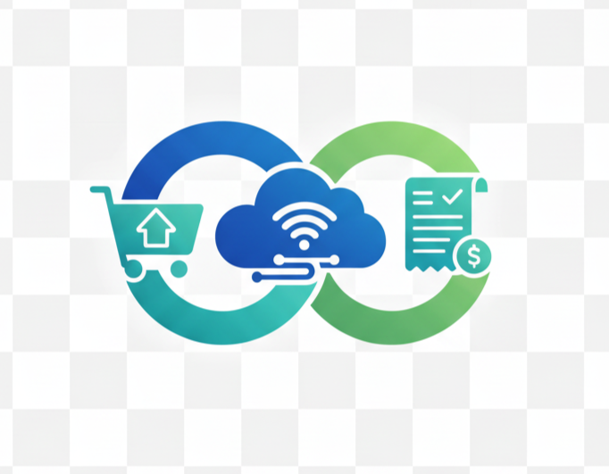

# Billventory 

A modern, minimal, and responsive inventory and billing management web app for retail stores, built with React, Supabase, and a custom design system.


## Features

- **Authentication**: Secure login with session management
- **Dashboard**: Modern navigation, animated transitions, and user profile
- **Products**: Add, edit, delete, and search products with real-time inventory updates
- **Billing**: Cart management, customer details, PDF/printable invoice, UPI QR code, and payment modal
- **Reports**: Sales analytics, date range filters, statistics cards, and transaction history with modal details
- **Online Orders**: Real-time order management with delete and status updates
- **Loading Screen**: Animated typewriter loader for a professional first impression
- **Design System**: Consistent colors, typography, spacing, border radius, and shadows across all components
- **Responsive**: Fully mobile-friendly and desktop-optimized

## Tech Stack

- **Frontend**: React 18+, Framer Motion, styled-components
- **Backend**: Supabase (PostgreSQL, Auth, Realtime)
- **PDF/Print**: jsPDF, jspdf-autotable, react-to-print
- **QR Code**: qrcode.react
- **Styling**: Custom design system (see `src/styles/designSystem.js`)

## Folder Structure

```
Billventory/
├── public/
│   ├── favicon.png
│   ├── index.html
│   └── ...
├── src/
│   ├── App.js
│   ├── components/
│   │   ├── Billing.js
│   │   ├── Dashboard.js
│   │   ├── Loader.js
│   │   ├── Login.js
│   │   ├── OnlineOrders.js
│   │   ├── Products.js
│   │   ├── ProtectedRoute.js
│   │   └── Reports.js
│   ├── contexts/
│   │   └── AuthContext.js
│   ├── styles/
│   │   ├── designSystem.js
│   │   └── Billing.css
│   └── ...
├── package.json
└── README.md
```

## Getting Started

1. **Clone the repository:**
	```sh
	git clone https://github.com/Sabari-Vasan-SM/Billventory.git
	cd Billventory
	```
2. **Install dependencies:**
	```sh
	npm install
	```
3. **Configure Supabase:**
	- Create a project at [supabase.com](https://supabase.com/)
	- Copy your Supabase URL and anon/public key
	- Update `src/supabaseClient.js` with your credentials
4. **Start the development server:**
	```sh
	npm start
	```
5. **Open in browser:**
	- Visit [http://localhost:3000](http://localhost:3000)

## Customization

- **Design System:**
  - Edit `src/styles/designSystem.js` to change colors, spacing, typography, and more.
- **Shop Details:**
  - Update shop name, address, phone, GSTIN, and UPI ID in `Billing.js`.

## Screenshots

| Login | Dashboard | Products | Billing | Reports |
|-------|-----------|----------|---------|---------|
|  |  |  |  |  |

## License

MIT © Sabari Vasan S M

---

> Modern UI, smooth animations, and robust inventory management for your retail business.
